# 🏗️ Sheratan Core v2 – Architecture Overview

## 📊 System Architecture Diagram

```mermaid
graph TB
    subgraph "External"
        User[👤 User/Dashboard]
        Browser[🌐 Chrome Debug<br/>Port 9222]
    end

    subgraph "Sheratan Core System"
        subgraph "Backend Service :8000"
            BackendAPI[Backend API<br/>FastAPI]
            MissionSvc[Mission Service]
            Metrics[Metrics Stream<br/>WebSocket]
        end

        subgraph "Core Service :8001"
            CoreAPI[Core API<br/>FastAPI]
            Storage[(File Storage<br/>data/)]
            Bridge[WebRelay Bridge]
            LCP[LCP Interpreter]
        end

        subgraph "Worker Service"
            WorkerLoop[Worker Loop]
            Tools[Tool Handlers<br/>list_files<br/>read_file<br/>write_file<br/>rewrite_file]
            LLMClient[LLM Client]
        end

        subgraph "WebRelay Service :3000"
            RelayAPI[WebRelay API]
            Puppeteer[Puppeteer<br/>Browser Control]
        end

        subgraph "Shared Volumes"
            RelayOut[📁 relay-out/<br/>Job Queue]
            RelayIn[📁 relay-in/<br/>Result Queue]
            Project[📁 project/<br/>Workspace]
        end
    end

    subgraph "External LLM"
        LLM[🤖 LLM Provider<br/>OpenAI/Ollama/LM Studio]
    end

    %% User interactions
    User -->|HTTP| BackendAPI
    User -->|HTTP| CoreAPI

    %% Backend to Core
    BackendAPI -->|Create Mission/Task/Job| CoreAPI
    MissionSvc -->|HTTP :8001| CoreAPI

    %% Core internal flow
    CoreAPI --> Storage
    CoreAPI --> Bridge
    Bridge -->|Dispatch Job| RelayOut
    Bridge -->|Read Result| RelayIn
    CoreAPI --> LCP
    LCP -->|Create Followup Jobs| CoreAPI

    %% Worker flow
    WorkerLoop -->|Poll Jobs| RelayOut
    WorkerLoop --> Tools
    WorkerLoop -->|Write Result| RelayIn
    Tools -->|File Operations| Project
    LLMClient -->|HTTP Call| LLM
    WorkerLoop --> LLMClient

    %% WebRelay flow
    RelayAPI -->|Read Jobs| RelayOut
    RelayAPI -->|Write Results| RelayIn
    RelayAPI --> Puppeteer
    Puppeteer -->|CDP| Browser
    Browser -->|ChatGPT etc.| LLM

    %% Metrics
    CoreAPI -->|Log Calls| BackendAPI
    WorkerLoop -.->|Auto-sync| CoreAPI
    Metrics -->|WebSocket| User

    style CoreAPI fill:#4a90e2,stroke:#2e5c8a,color:#fff
    style BackendAPI fill:#50c878,stroke:#2d7a4a,color:#fff
    style WorkerLoop fill:#ffa500,stroke:#cc8400,color:#fff
    style RelayAPI fill:#9b59b6,stroke:#6c3483,color:#fff
    style LCP fill:#e74c3c,stroke:#a93226,color:#fff
    style LLM fill:#f39c12,stroke:#b87a0d,color:#fff
```



## 🔌 API Ports & Endpoints

### 📍 Port 8000 – Backend Service

**Container:** `sheratan_backend`  
**Base URL:** `http://localhost:8000`

| Endpoint | Method | Description | File |
|----------|--------|-------------|------|
| `/` | GET | Health check | `backend/main.py` |
| `/missions` | GET | List all missions | `backend/main.py` |
| `/missions/start` | POST | Create & start mission with task | `backend/main.py` |
| `/missions/{mission_id}/status` | GET | Aggregated mission status (sync) | `backend/main.py` |
| `/missions/{mission_id}/apply_plan/{job_id}` | POST | Apply agent plan followups | `backend/main.py` |
| `/api/missions/standard-code-analysis` | POST | One-click code analysis mission | `backend/main.py` |
| `/metrics/module-calls` | POST | Record module call metrics | `backend/metrics_stream.py` |
| `/metrics/stream` | WebSocket | Real-time metrics stream | `backend/metrics_stream.py` |

**Environment Variables:**
- `UVICORN_HOST=0.0.0.0`
- `UVICORN_PORT=8000`
- `SHERATAN_CORE_URL=http://core:8001`

---

### 📍 Port 8001 – Core Service (mapped from :8000)

**Container:** `sheratan_core`  
**Base URL:** `http://localhost:8001`  
**Internal:** `http://core:8000`

#### Missions API

| Endpoint | Method | Description | File |
|----------|--------|-------------|------|
| `/api/missions` | POST | Create mission | `core/sheratan_core_v2/main.py:65` |
| `/api/missions` | GET | List all missions | `core/sheratan_core_v2/main.py:72` |
| `/api/missions/{mission_id}` | GET | Get mission details | `core/sheratan_core_v2/main.py:77` |

#### Tasks API

| Endpoint | Method | Description | File |
|----------|--------|-------------|------|
| `/api/missions/{mission_id}/tasks` | POST | Create task for mission | `core/sheratan_core_v2/main.py:89` |
| `/api/tasks` | GET | List all tasks | `core/sheratan_core_v2/main.py:100` |
| `/api/tasks/{task_id}` | GET | Get task details | `core/sheratan_core_v2/main.py:105` |

#### Jobs API

| Endpoint | Method | Description | File |
|----------|--------|-------------|------|
| `/api/tasks/{task_id}/jobs` | POST | Create job for task | `core/sheratan_core_v2/main.py:117` |
| `/api/jobs` | GET | List all jobs | `core/sheratan_core_v2/main.py:128` |
| `/api/jobs/{job_id}` | GET | Get job details | `core/sheratan_core_v2/main.py:133` |
| `/api/jobs/{job_id}/dispatch` | POST | **Dispatch job to worker** | `core/sheratan_core_v2/main.py:145` |
| `/api/jobs/{job_id}/sync` | POST | **Sync result + LCP followups** | `core/sheratan_core_v2/main.py:205` |

#### System API

| Endpoint | Method | Description | File |
|----------|--------|-------------|------|
| `/` | GET | Root status | `core/sheratan_core_v2/main.py:264` |
| `/api/status` | GET | System status | `core/sheratan_core_v2/main.py:255` |
| `/static/*` | GET | Static files (dashboards) | `core/sheratan_core_v2/main.py:45` |

**Environment Variables:**
- `SHERATAN_METRICS_URL=http://backend:8000/metrics/module-calls`

**Volumes:**
- `core-data:/app/data` – Persistent storage
- `relay-out:/app/webrelay_out` – Job queue (outgoing)
- `relay-in:/app/webrelay_in` – Result queue (incoming)

---

### 📍 Port 3000 – WebRelay Service

**Container:** `sheratan_webrelay`  
**Base URL:** `http://localhost:3000` (host network mode)

| Endpoint | Method | Description | File |
|----------|--------|-------------|------|
| `/api/relay` | POST | Send prompt to browser | `webrelay/src/relay-handler.ts` |
| `/health` | GET | Health check | `webrelay/src/index.ts` |

**Environment Variables:**
- `BROWSER_URL=http://localhost:9222` – Chrome Debug Port
- `WEB_INTERFACE_URL=https://chatgpt.com`
- `PORT=3000`

**Volumes:**
- `relay-out:/app/webrelay_out` – Shared job queue
- `relay-in:/app/webrelay_in` – Shared result queue

---

### 🔄 Worker Service (No HTTP Port)

**Container:** `sheratan_worker`  
**Mode:** File-based queue polling

**Supported Tool Kinds:**

| Kind | Description | File | Handler |
|------|-------------|------|---------|
| `list_files` | List files matching patterns | `worker/worker_loop.py:14` | `list_files_from_params()` |
| `read_file` | Read file content | `worker/worker_loop.py:93` | `read_file_from_params()` |
| `write_file` | Write/append to file | `worker/worker_loop.py:131` | `write_file_from_params()` |
| `rewrite_file` | Overwrite file completely | `worker/worker_loop.py:184` | `rewrite_file_from_params()` |
| `llm_call` | Generic LLM call | `worker/worker_loop.py:371` | `call_llm_generic()` |
| `agent_plan` | LLM-based planning | `worker/worker_loop.py:664` | `run_agent_plan()` |

**Environment Variables:**
- `SHERATAN_CORE_URL=http://core:8000` – For auto-sync callbacks
- `SHERATAN_LLM_BASE_URL` – LLM provider URL (optional)
- `SHERATAN_LLM_MODEL=gpt-4-mini` – Model name
- `SHERATAN_LLM_API_KEY` – API key (if required)

**Volumes:**
- `relay-out:/webrelay_out` – Polls for `*.job.json` files
- `relay-in:/webrelay_in` – Writes `*.result.json` files
- `./project:/workspace/project` – Workspace files

---

## 🔄 Self-Loop & LCP Flow

### Job Lifecycle

```
┌─────────────────────────────────────────────────────────────┐
│  1. User creates Mission via Backend or Core                │
│     POST /api/missions                                       │
└─────────────────┬───────────────────────────────────────────┘
                  │
                  ▼
┌─────────────────────────────────────────────────────────────┐
│  2. Mission Service creates Tasks                           │
│     POST /api/missions/{id}/tasks                           │
└─────────────────┬───────────────────────────────────────────┘
                  │
                  ▼
┌─────────────────────────────────────────────────────────────┐
│  3. Task creates Jobs                                       │
│     POST /api/tasks/{id}/jobs                               │
└─────────────────┬───────────────────────────────────────────┘
                  │
                  ▼
┌─────────────────────────────────────────────────────────────┐
│  4. Job Dispatch to Worker                                  │
│     POST /api/jobs/{id}/dispatch                            │
│     → Writes {job_id}.job.json to relay-out/               │
│     → Starts background polling thread                      │
└─────────────────┬───────────────────────────────────────────┘
                  │
                  ▼
┌─────────────────────────────────────────────────────────────┐
│  5. Worker processes Job                                    │
│     • Polls relay-out/ for *.job.json                       │
│     • Executes tool (list_files, read_file, llm_call, etc.) │
│     • Writes {job_id}.result.json to relay-in/              │
└─────────────────┬───────────────────────────────────────────┘
                  │
                  ▼
┌─────────────────────────────────────────────────────────────┐
│  6. Core syncs Result (auto or manual)                      │
│     POST /api/jobs/{id}/sync                                │
│     • Reads result from relay-in/                           │
│     • Updates Job in storage                                │
│     • Passes result to LCP Interpreter                      │
└─────────────────┬───────────────────────────────────────────┘
                  │
                  ▼
┌─────────────────────────────────────────────────────────────┐
│  7. LCP Interpreter processes Result                        │
│     lcp_actions.handle_job_result()                         │
│                                                              │
│     IF result.action == "create_followup_jobs":             │
│       → Creates new Jobs from result.new_jobs[]             │
│       → Auto-dispatches if auto_dispatch == true            │
│       → AUTONOMOUS LOOP ACTIVATED ✨                         │
└─────────────────────────────────────────────────────────────┘
```

### LCP (Language Control Protocol) Format

**Job Response Format:**

```json
{
  "ok": true,
  "action": "create_followup_jobs",
  "commentary": "Brief explanation of what was done",
  "new_jobs": [
    {
      "name": "Human-readable job name",
      "description": "Optional detailed description",
      "kind": "list_files | read_file | write_file | rewrite_file | llm_call",
      "params": {
        "root": "/workspace/project",
        "patterns": ["**/*.py"]
      },
      "auto_dispatch": true
    }
  ]
}
```

**Supported Actions:**
- `create_followup_jobs` → Creates new jobs automatically
- `text_result` → Stores plain text summary
- `error` → Reports error condition

**LCP Integration Files:**
- `core/sheratan_core_v2/lcp_actions.py` – Action interpreter
- `core/sheratan_core_v2/webrelay_bridge.py` – Queue bridge
- `worker/worker_loop.py:371-661` – LLM call handler with LCP parsing

---

## 📂 File Structure Reference

### Core Service Files

```
core/
├── sheratan_core_v2/
│   ├── main.py              # FastAPI app, all API endpoints
│   ├── models.py            # Pydantic models (Mission, Task, Job)
│   ├── storage.py           # File-based persistence
│   ├── webrelay_bridge.py   # Job queue management
│   ├── lcp_actions.py       # LCP interpreter & followup creation
│   └── metrics_client.py    # Metrics logging
├── data/                    # Persistent storage (missions, tasks, jobs)
└── Dockerfile
```

### Backend Service Files

```
backend/
├── main.py                      # Backend API endpoints
├── metrics_stream.py            # WebSocket metrics streaming
└── sheratan_core_adapter/
    └── mission_service.py       # Mission orchestration logic
```

### Worker Service Files

```
worker/
├── worker_loop.py               # Main worker loop & tool handlers
│   ├── list_files_from_params() # Line 14-70
│   ├── read_file_from_params()  # Line 93-128
│   ├── write_file_from_params() # Line 131-181
│   ├── rewrite_file_from_params() # Line 184-226
│   ├── call_llm_generic()       # Line 371-661 (LCP support)
│   ├── run_agent_plan()         # Line 664-704
│   └── handle_job()             # Line 707-775
└── Dockerfile
```

### WebRelay Service Files

```
webrelay/
├── src/
│   ├── index.ts             # Main server
│   ├── relay-handler.ts     # Browser automation handler
│   └── puppeteer-setup.ts   # Puppeteer initialization
├── prompts/
│   └── lcp_system.md        # LCP system prompt
└── Dockerfile
```

---

## 🎯 Key Integration Points

### 1. Core → Worker (Dispatch)

**File:** `core/sheratan_core_v2/main.py:145-198`  
**Method:** File-based queue via `webrelay_bridge.enqueue_job()`  
**Writes to:** `relay-out/{job_id}.job.json`  
**Auto-sync:** Background thread polls for results (60s timeout)

### 2. Worker → Core (Result)

**File:** `worker/worker_loop.py:777-834`  
**Method:** File-based queue, writes result file  
**Writes to:** `relay-in/{job_id}.result.json`  
**Sync trigger:** Core auto-sync thread OR manual POST `/api/jobs/{id}/sync`

### 3. Core → LCP Interpreter (Followups)

**File:** `core/sheratan_core_v2/lcp_actions.py`  
**Trigger:** After job sync in `main.py:245`  
**Actions:**
- Parses `result.action`
- Creates new Jobs if `action == "create_followup_jobs"`
- Auto-dispatches if `auto_dispatch == true`

### 4. Backend → Core (Orchestration)

**File:** `backend/sheratan_core_adapter/mission_service.py`  
**Uses:** HTTP calls to Core API (`SHERATAN_CORE_URL`)  
**Flow:**
- Creates Mission
- Creates Task
- Creates Job
- Dispatches Job
- Polls for status

---

## 🔧 Configuration Files

### Docker Compose

**File:** `docker-compose.yml`

| Service | Image Port | Host Port | CPU | RAM |
|---------|-----------|-----------|-----|-----|
| backend | 8000 | 8000 | 0.5 | 256M |
| core | 8000 | 8001 | 1.0 | 512M |
| worker | - | - | 0.5 | 256M |
| webrelay | 3000 | 3000 | - | - |

### Environment Variables

**File:** `.env` (based on `.env.example`)

```bash
# LLM Configuration (used by Worker)
SHERATAN_LLM_BASE_URL=<LLM endpoint>
SHERATAN_LLM_MODEL=gpt-4-mini
SHERATAN_LLM_API_KEY=<optional>

# Options:
# - LM Studio: http://host.docker.internal:1234/v1/chat/completions
# - Ollama: http://host.docker.internal:11434/v1/chat/completions  
# - OpenAI: https://api.openai.com/v1/chat/completions
# - WebRelay: http://host.docker.internal:3000/api/relay
```

---

## 🚀 Quick Reference

### Start the System

```bash
cd 2_sheratan_core
docker-compose up --build
```

### Create a Mission (via Backend)

```bash
curl -X POST http://localhost:8000/missions/start \
  -H "Content-Type: application/json" \
  -d '{
    "user_id": "test",
    "title": "Analyze Project",
    "description": "List and analyze all Python files",
    "project_root": "/workspace/project"
  }'
```

### Create a Mission (via Core directly)

```bash
curl -X POST http://localhost:8001/api/missions \
  -H "Content-Type: application/json" \
  -d '{
    "title": "Code Analysis",
    "description": "Analyze codebase"
  }'
```

### Check Mission Status

```bash
curl http://localhost:8000/missions/{mission_id}/status
```

### Monitor Metrics (WebSocket)

```javascript
const ws = new WebSocket('ws://localhost:8000/metrics/stream');
ws.onmessage = (event) => console.log(JSON.parse(event.data));
```

---

**Last Updated:** December 2025  
**Version:** 2.0.0
